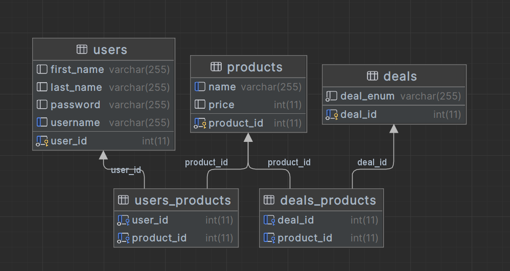
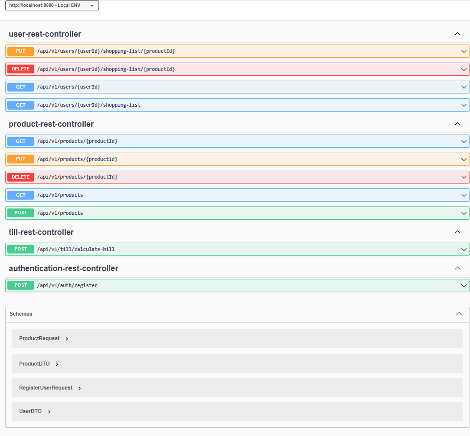

<h1 align="center">🛒 Groceries Shop - RESTful API</h1>

  <strong>A modern checkout solution demonstrating sophisticated software engineering practices using Java and Spring Boot.</strong>

---

## 📚 Table of Contents

- [Overview](#-overview)
- [Tech Stack](#%EF%B8%8F-tech-stack)
- [Getting Started](#-getting-started)
  - [Database Setup](#%EF%B8%8F-database-setup)
- [Swagger API Documentation](#-swagger-api-documentation)

---

## 📜 Overview

Welcome to the **Groceries Shop** repository, a modern checkout solution demonstrating sophisticated software engineering practices in Java and Spring Boot. This system is capable of scanning various fruits and vegetables, applying exclusive discount schemes, and generating a final bill in the unique "aws" and "clouds" currency format.

---

## 🛠️ Tech Stack

- **Language**: Java
- **Framework**: Spring Boot
- **Database**: MariaDB
- **Build Tool**: Gradle
- **Testing**: Mockito, JUnit
- **API Documentation**: Swagger UI

---

## 🚀 Getting Started

### 🗃️ Database Setup

#### Database Schema

#### Step 1: Install MariaDB

- Begin by downloading and installing MariaDB onto your system. You can find the installation instructions for your specific operating system on the [MariaDB download page](https://mariadb.org/download/).

#### Step 2: Ensure MariaDB is Running

- Ensure that the MariaDB service is up and running. The default port for MariaDB is `3306`.

#### Step 3: Access MariaDB Query Console

- Once the service is active, you can access the MariaDB query console to execute SQL commands.

#### Step 4: Set Up Database Schema

- Locate and execute the `grocery-shop-script.sql` file within the `db` folder of the project to set up the schema for your Groceries Shop database.

#### Step 5: Populate Database with Data

- After setting up the schema, populate the database with initial data by executing the `grocery-shop-data.sql` file found in the `db` folder.

---

## 📄 Swagger API Documentation

For easy navigation and testing of the Groceries Shop RESTful API, access the Swagger UI documentation by clicking the image below:

---
